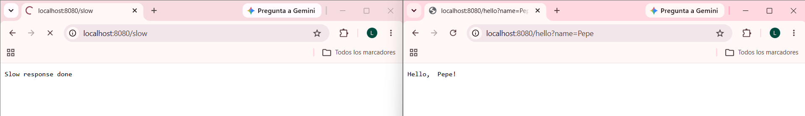
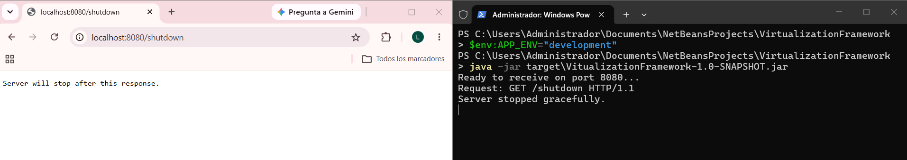
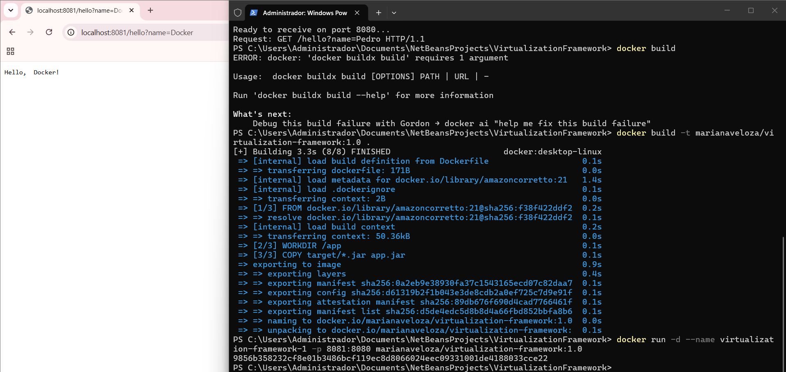
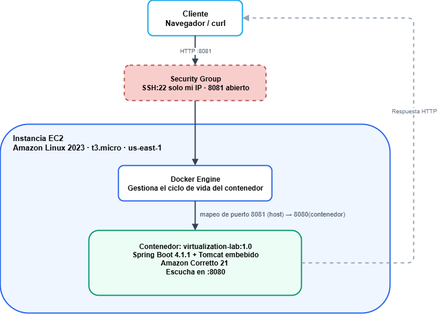
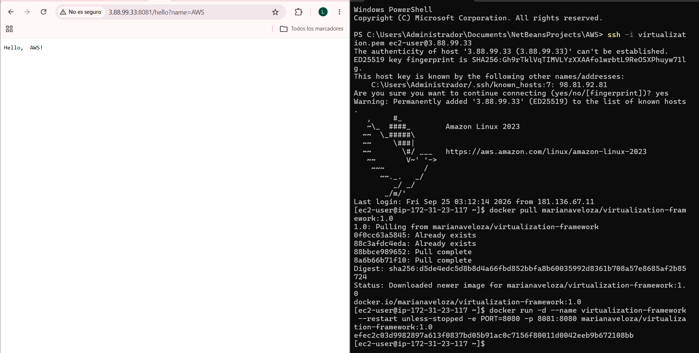

# VirtualizationFramework

Este repositorio contiene la extensión de mi propio framework web en Java, hecha sin usar Spring, como parte del taller de contenerización y despliegue. Parte del código de ServidorWebMantenible, un proyecto anterior que ya tenía rutas GET registradas mediante lambdas, servicio de archivos estáticos y apagado controlado. A partir de ahí se le agregó manejo de solicitudes concurrentes, y se contenerizó y desplegó en AWS EC2.

## 1. Estado actual del framework

El framework expone rutas HTTP simples registradas mediante lambdas, sin ningún framework externo de por medio, solo con sockets planos de Java. La clase Application es la que arranca todo, ahí se registran las rutas disponibles y se llama al método que pone a correr el servidor. La lógica de red vive en HttpServer, que abre el socket del servidor, acepta conexiones, interpreta la petición HTTP entrante (método, ruta, query string) y decide si esa ruta corresponde a un endpoint dinámico registrado o a un recurso estático que hay que servir desde disco. La clase ServidorWebMantenible lleva el registro de rutas y el estado de si el servidor sigue corriendo o no, incluyendo el método que lo detiene. Router, Request y Response modelan una petición y su ruta ya interpretadas, StaticFileService se encarga de servir archivos estáticos validando que la ruta pedida sea segura, y WebService es la interfaz funcional detrás de cada ruta registrada.

Estas son las rutas que existen hoy:

| Ruta | Qué hace |
|---|---|
| GET /pi | Devuelve el valor de pi |
| GET /e | Devuelve el valor de e |
| GET /hello?name= | Un saludo simple, con un prefijo que se puede configurar por variable de entorno |
| GET /square?value= | Devuelve el cuadrado del número que se le pase |
| GET /shutdown | Detiene el servidor, solo está disponible cuando el ambiente es de desarrollo |
| GET /slow | Una ruta de prueba que tarda cinco segundos en responder, se usa como evidencia de que el servidor maneja concurrencia |

El puerto en el que escucha el servidor se decide con esta prioridad: primero mira si se pasó como argumento de línea de comandos, si no lo encuentra ahí revisa la variable de entorno PORT, y si tampoco existe usa 8080 por defecto.

## 2. Cambios introducidos en la extensión

El cambio principal de esta extensión fue agregarle manejo de solicitudes concurrentes al servidor. Antes de esto, el servidor aceptaba una conexión y la procesaba de principio a fin antes de volver a aceptar la siguiente, así que si dos personas entraban al mismo tiempo, la segunda simplemente se quedaba esperando a que la primera terminara, sin importar cuánto tardara.

Para resolver eso se agregó un pool de hilos, de forma que cada conexión que se acepta se delega a un hilo aparte, y el bucle principal queda libre para volver a aceptar conexiones nuevas de inmediato, sin esperar a que la anterior termine de procesarse. En términos prácticos, el método que antes procesaba cada solicitud directamente dentro del bucle de aceptación ahora solo la entrega a ese pool de hilos, que corre en segundo plano y libera el bucle principal de inmediato. Cuando el servidor se detiene, el pool se apaga de forma ordenada antes de cerrar el socket principal.

Para comprobar que este cambio realmente funcionaba, se agregó una ruta de prueba que simula una solicitud lenta, esperando cinco segundos antes de responder. Al abrir dos pestañas del navegador casi al mismo tiempo, una apuntando a esa ruta lenta y otra a una ruta normal, la segunda responde de inmediato sin tener que esperar a que la primera termine, algo que antes de este cambio no pasaba.

Evidencia de esa prueba de concurrencia:



El resto de las capacidades ya venían del proyecto original y no se modificaron. El apagado controlado sigue funcionando igual, se activa entrando a la ruta de apagado (que solo está disponible en modo desarrollo), y el servidor responde y termina el proceso de forma limpia, mostrando en la consola que se detuvo correctamente. La configuración de puerto por variable de entorno también seguía funcionando desde antes.

Evidencia del apagado controlado:



## 3. Cómo construir y correr el proyecto

Para tenerlo corriendo localmente, primero clona el repositorio y ubícate en la carpeta raíz, donde está el archivo pom.xml. Desde ahí, compílalo y empaquétalo con Maven:

```bash
mvn clean package
```

Luego corre el jar que se generó:

```bash
java -jar target/VitualizationFramework-1.0-SNAPSHOT.jar
```

Con el servidor arriba, puedes probar cualquiera de las rutas desde el navegador:

```
http://localhost:8080/hello?name=Pedro
```

Para comprobar que la concurrencia funciona, abre dos pestañas casi al mismo tiempo, una en la ruta lenta y otra en una ruta rápida:

```
http://localhost:8080/slow
http://localhost:8080/hello?name=Pedro
```

La segunda debería responder de inmediato, mientras la primera sigue procesándose de fondo durante sus cinco segundos.

Para probar el apagado controlado, corre el jar con la variable de entorno que activa el modo desarrollo:

```powershell
$env:APP_ENV="development"
java -jar target/VitualizationFramework-1.0-SNAPSHOT.jar
```

Y visita la ruta de apagado desde el navegador. El servidor debería responder y luego cerrarse solo, mostrando en la terminal que se detuvo correctamente.

## 4. Cómo correrlo en Docker

Desde la raíz del repo, donde está el Dockerfile, construye la imagen:

```bash
docker build -t marianaveloza/virtualization-framework:1.0 .
```

Corre un contenedor a partir de esa imagen:

```bash
docker run -d --name virtualization-framework-1 -p 8081:8080 marianaveloza/virtualization-framework:1.0
```

Y prueba el endpoint ya contenerizado:

```
http://localhost:8081/hello?name=Docker
```

Evidencia del contenedor corriendo localmente:



La imagen también quedó publicada en Docker Hub, en [hub.docker.com/r/marianaveloza/virtualization-framework](https://hub.docker.com/r/marianaveloza/virtualization-framework), con las etiquetas 1.0 y latest.

## 5. Evidencia de avance

El historial de commits de este repositorio muestra el progreso paso a paso: [github.com/LuizaGonzalez/VirtualizationFramework/commits/main](https://github.com/LuizaGonzalez/VirtualizationFramework/commits/main)

Los commits más importantes de esta extensión son el que reorganiza el paquete siguiendo la convención usada en el resto del taller, el que agrega el manejo de solicitudes concurrentes con el pool de hilos, el que agrega la ruta de prueba para demostrar que esa concurrencia funciona de verdad, el que configura el manifest del jar para que se pueda correr de forma independiente fuera de NetBeans, y el que agrega el Dockerfile para contenerizar todo.

## 6. Diagrama del modelo de despliegue



Es el mismo flujo del taller principal, adaptado a este framework: el cliente hace una solicitud HTTP, que pasa primero por el security group de la instancia, llega a la máquina virtual EC2, ahí Docker Engine dirige la solicitud al contenedor correspondiente, y ese contenedor corre el framework escuchando en su puerto interno. Como esta instancia se comparte con el otro proyecto del taller, el mapeo de puertos es distinto: por fuera se entra por el 8081, y por dentro el contenedor sigue escuchando en el 8080 de siempre.

## 7. Evidencia de despliegue en la nube

El framework se desplegó en la misma instancia EC2 que se usó para el taller principal, corriendo al mismo tiempo que la otra aplicación pero en un puerto distinto para no chocar entre sí.

```bash
docker pull marianaveloza/virtualization-framework:1.0
docker run -d --name virtualization-framework --restart unless-stopped \
  -e PORT=8080 -p 8081:8080 marianaveloza/virtualization-framework:1.0
```

La URL pública donde se puede probar es:

http://3.88.99.33:8081/hello?name=AWS

(vale aclarar que esa IP puede cambiar si la instancia se detiene y se vuelve a encender)

Evidencia del endpoint respondiendo desde la instancia de EC2:



Y un video corto mostrando el despliegue local en Docker y el despliegue en EC2 funcionando:

[Ver video de evidencia](https://youtu.be/67C9v42gvjk)